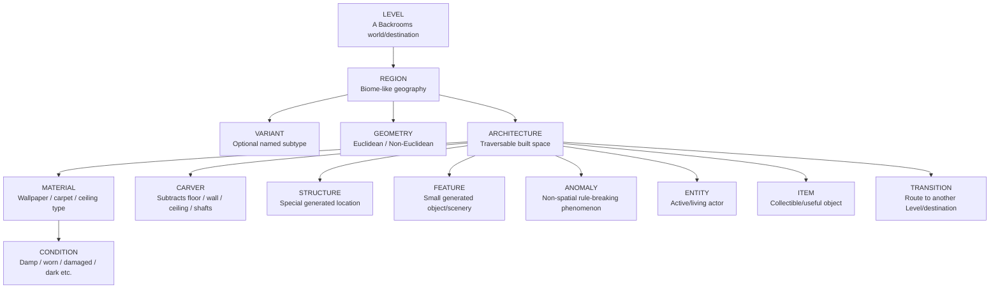

# Project Noclip World Bible

This is the canonical human-facing vocabulary and world-content catalog for Project Noclip.

GitHub code and accepted `STATUS.md` remain authoritative for exact runtime behaviour. This file answers: **what kinds of things exist in the game, what are they called, and what state are they in?**

## Maintenance contract

When accepted work adds, removes, renames, reclassifies, or materially changes a **Level, Region, Variant, Geometry, Material, Condition, Feature, Structure, Carver, Anomaly, Entity, Item, Transition**, or a related engine/legacy world-generation concept, update this file in the same pull request.

Rules:

- Never present planned content as implemented.
- Keep useful empty categories visible as `None implemented`.
- Keep legacy implementation vocabulary documented until the migration that removes it is accepted.
- If code and this catalog disagree, resolve the mismatch before claiming the catalog is current.
- Material catalog changes should be mirrored to the mapped Project Noclip Notion page during the normal material Notion sync.
- A `Cell` is a technical streaming/computation unit, **not a room**.
- Generation 3 target architecture is tracked by GitHub Issue #31. This file records vocabulary/current content; Issue #31 records migration work.

## Status vocabulary

| Status | Meaning |
|---|---|
| **Implemented** | Exists in the accepted playable/runtime build or accepted engine/tooling framework where explicitly stated. |
| **Registered** | Exists in data/transition registries but is not playable content yet. |
| **Legacy** | Exists in the current Gen-2 implementation but is intended to be replaced/reclassified by Gen 3. |
| **Planned** | Accepted direction, not implemented runtime behaviour yet. |
| **None implemented** | The category exists conceptually but has no first-class implementation yet. |

---

# 1. Everyday design vocabulary

These are the terms Sash should normally use when describing world content to agents.



| Term | Simple meaning | Minecraft-ish analogy | Project Noclip rule |
|---|---|---|---|
| **Level** | A major Backrooms world/destination. | Dimension | Level 0 is the only playable Level today. |
| **Region** | A large coherent geographic/environmental area inside a Level. | Biome | Preferred Gen-3 geography term. Regions should usually emerge from continuous conditions rather than hard room templates. |
| **Variant** | An optional named subtype of a Region. | Biome variant | Use only when a subtype deserves a stable name. Continuous changes do not automatically become Variants. |
| **Geometry** | The spatial law of an area. | World/terrain law | Only two canonical values: **Euclidean** and **Non-Euclidean**. |
| **Material** | A named construction/finish type. | Wood/block family | Wallpaper, carpet, ceiling or other semantic finish type. |
| **Condition** | A state layered onto architecture, materials, fixtures or objects. | Block state | Damp, worn, damaged, dark, flickering, missing, etc. |
| **Feature** | Small generated object/scenery placed into the world. | Tree, ore, plant | Chairs, desks, papers and similar non-structural content belong here. |
| **Structure** | A special generated location/discovery. | Village, temple, stronghold | Manila Room is the clearest current example. `Rare` is an attribute of a Structure, not a separate category. |
| **Carver** | A subtractive generator that removes ordinary architecture. | Cave carver | Used for holes, shafts, missing walls/floors/ceilings. |
| **Anomaly** | A localized rule-breaking phenomenon that is not merely spatial geometry. | Rare world phenomenon | Purely spatial impossibility belongs under **Geometry**, not Anomaly. |
| **Entity** | Active/living actor in the world. | Mob | None implemented as a routine world population system yet. |
| **Item** | Collectible/useful world object. | Item | Implemented registry. |
| **Transition** | Route/trigger toward another Level or destination. | Portal/exit | Exit foundations exist even when destination Levels are not playable. |

## Geometry: only Euclidean or Non-Euclidean

`Distorted` is **not** a separate Geometry category.

- **Euclidean** — ordinary spatial relationships. Routes reverse normally and local dimensions/connectivity obey expected geometry.
- **Non-Euclidean** — space itself violates ordinary geometry/topology in a deterministic, save-safe way.

Useful **Non-Euclidean behaviours** are descriptions, not separate top-level Geometry values:

- **metric distortion** — internal distance/scale cannot reconcile with surrounding space;
- **impossible adjacency** — spaces connect in mutually incompatible ways;
- **loop** — continued travel returns to an impossible prior location/relationship;
- **asymmetric route** — A → B does not imply the same B → A path;
- **spatial discontinuity** — a boundary/door/path maps to a location that ordinary continuous space cannot explain.

Crooked walls, strange proportions, changing ceiling height or unsettling visuals remain **Euclidean** unless the spatial law itself becomes impossible.

## Simplification rules

To avoid vocabulary bloat:

- Use **Region**, not `environment regime`, `environment class`, or `biome class`, for the human-facing geographic label.
- Use **Geometry**, not `Geometry Regime`.
- Use **Material**, not `Material Family`, in ordinary discussion.
- Use **Condition** for fixture/object/environment state; do not create separate `Object State` or `Fixture State` world categories.
- Use **Structure** for special locations; `rare`, `unique`, `common`, etc. are properties of Structures, not new categories.
- Use **Anomaly** only for exceptional non-spatial phenomena. Spatial impossibility belongs under **Non-Euclidean Geometry**.
- `Field`, `Cell`, `District`, `Archetype`, `Spatial Profile`, `Component` and `Prop` are engine/legacy vocabulary, not equal top-level design categories.

---

# 2. Engine vocabulary

These terms remain important to agents/code, but Sash does not need to use them for ordinary design requests.

| Engine term | Meaning | Current state |
|---|---|---|
| **Field** | Smooth deterministic value sampled from seed/world coordinates that can drive generation. | **Implemented framework.** `src/world/fields.ts` samples all canonical Gen-3 Fields continuously; current Gen-2 generation does **not** consume them yet. |
| **Cell** | Streaming/computation unit. | Implemented. **Never a room.** |
| **District** | Coarse deterministic planning grouping. | Current generator groups cells into 5×5 districts for legacy zone selection. |
| **Seed domain** | Independent deterministic namespace for a generation layer. | **Implemented for the Field sampler**; broader layer-by-layer separation remains Generation 3 direction. |

### Implemented Gen-3 Field framework

The accepted Slice-A framework exposes these deterministic scalar Fields:

- `openness`
- `partitionPressure`
- `axisFlow`
- `roomScale`
- `columnPressure`
- `ceilingVariation`
- `regularity`
- `connectivityPressure`
- `dampness`
- `decay`
- `stability`
- `abnormality`
- `voidPressure`
- `clutterPressure`
- `electricalReliability`

Framework laws:

- sampling uses **world-space metres**, not Cell-local coordinates;
- each Field combines **168 m, 56 m and 21 m** deterministic scales so geography exists at multiple distances;
- interpolation is continuous across Cell boundaries;
- values are bounded to `0..1`;
- deterministic domains are separated from current generator hashes and from one another;
- current Geometry metadata is **Euclidean** only;
- these values are **diagnostic/read-only in Slice A** and therefore do not alter legacy zone/layout/connector output yet.

Developer diagnostics:

```text
npm run fields:lab -- [seed] [worldX] [worldZ]
```

The normal 10,000-cell benchmark also reports a separate 10,000-sample Field timing/range/Cell-boundary continuity section. Human-facing output should still usually be discussed as Regions, Geometry, Materials, Conditions, Features, Structures, etc.

---

# 3. Current world catalog

## Levels

### Playable

| Level | Status | Notes |
|---|---|---|
| **Level 0** | **Implemented** | Current browser-first vertical slice and only playable Level. |

### Registered transition destinations — not playable Levels

| Destination | Status | Current transition label | Enabled exit foundation |
|---|---|---|---|
| **Level 1** | **Registered** | Garage-like transition | Yes |
| **Level 2** | **Registered** | Manila departure | Yes |
| **Level 27** | **Registered** | Carpet breach | Yes |
| **Level 483** | **Registered** | Weak wall breach | Yes |
| **Level 13** | **Registered** | Greenhouse doors | Yes |
| **Level 14** | **Registered** | Emergency exit | Yes |
| **Level 0.22** | **Registered** | Second Attempt | No |
| **Level 0.23** | **Registered** | Next Project | No |
| **Level 0.99** | **Registered** | Deep-distance fracture | No |
| **Red Rooms** | **Registered** | Crimson contamination | No |
| **Void** | **Registered** | Unresolved floor failure | No |

A registered destination means its ID/exit exists. It does **not** mean the destination is implemented as a playable Level.

## Regions

### Canonical Gen-3 Regions

**None implemented yet.**

The accepted runtime still uses legacy `ZoneId`s as the nearest region-like implementation:

| Legacy ID | Human label | Status | Gen-3 direction |
|---|---|---|---|
| `baseline` | Baseline Lobby / ordinary Level 0 | **Legacy implemented** | Ordinary Level 0 should emerge from stable Field conditions. |
| `arch` | Arch Rooms | **Legacy implemented** | Reclassify only if a coherent Region still exists after field-driven architecture lands. |
| `pillar` | Pillar Field | **Legacy implemented** | Reclassify only if pillar-heavy geography deserves a stable Region label. |
| `blackout` | Blackout Zone | **Legacy implemented** | Likely represented mainly through Conditions/Fields rather than a hard zone. |
| `holes` | Hole Section | **Legacy implemented** | Future void/Carver pressure should generate this effect over ordinary Level 0. |
| `exit-threshold` | Exit Threshold | **Legacy implemented** | Better modeled as a Transition/Structure than ordinary geography. |
| `manila` | Manila compatibility profile | **Legacy compatibility only** | **Not a Region.** Manila is a Structure. |

## Variants

### Canonical Gen-3 Region Variants

**None implemented yet.**

Current legacy spatial profiles are implementation metadata, not canonical Variants:

- `standard`
- `sparse-vista`
- `thin-channel`
- `pillar-expanse`

## Geometry

| Geometry | Status | Meaning |
|---|---|---|
| **Euclidean** | **Implemented baseline law** | Current playable topology/connectivity law and the only Geometry emitted by the Slice-A Field framework. |
| **Non-Euclidean** | **Planned Gen 3** | Deterministic impossible spatial relationships. Exact player-facing behaviours must be intentionally designed and verified. |

There is no separate `Distorted` Geometry.

## Materials

**None canonically named yet.**

Current runtime has unnamed wall material variant indices, zone-specific tints, ceiling pattern indices and floor-patch kinds. Named wallpaper/carpet/ceiling Materials should be added here only after they actually exist as semantic content.

## Conditions

Current implemented condition-like state includes:

| Condition system | Values/state |
|---|---|
| **Stability** | `disorienting`, `semi-stable`, `stable`, `rendezvous`, `terminal` |
| **Light** | `on`, `flicker`, `off` |
| **Floor patch vocabulary** | `damp`, `worn`, `dark`, `dry`, `hole` |
| **World shift** | deterministic `shiftEpoch` participates in some generated state |

A unified semantic Condition layer is **planned**, not yet first-class.

## Features

A first-class Gen-3 Feature layer is **not implemented yet**. The current legacy prop system mixes structure, service elements and scenery.

Current feature-like prop vocabulary includes:

- table
- chair
- cabinet
- box
- bench
- book
- stain
- carpet-patch

Current prop vocabulary that may instead become Architecture/service content includes:

- divider
- pipe
- column
- wall-panel
- ceiling-gap
- sign

Do not automatically classify every legacy `PropKind` as a future Feature.

## Structures

| Structure | Status | Notes |
|---|---|---|
| **Manila Room** | **Implemented** | One delayed seed-derived far special room inside baseline Level 0; not a Region. |
| **Exit Threshold** | **Legacy implemented** | Current exit-bearing cell state; Gen 3 should model threshold architecture as a Transition/Structure. |
| **Maintenance/service complex** | **Planned candidate** | Add only when accepted as actual content. |
| **Special stairwell/elevator** | **Planned candidate** | Add only when accepted as actual content. |

`Rare Structure` is not a separate vocabulary category. A Structure may simply be rare/unique/common.

## Carvers

**None implemented as a first-class carver pass.**

Planned examples:

- floor/void carver
- wall-opening carver
- shaft carver
- ceiling/service-cavity carver
- localized damage/degradation carver

Current holes still come from explicit legacy archetypes/components.

## Anomalies

**None implemented as a first-class anomaly registry.**

Current precursor: deterministic `hallucinationAnchor` on eligible generated cells.

Rule: if the phenomenon is only spatially impossible, classify it under **Non-Euclidean Geometry** instead of creating an Anomaly duplicate.

## Entities

**None implemented as a routine generated world population system.**

Routine monsters/combat remain outside the current Level 0 phase.

## Items

| Item | ID | Status |
|---|---|---|
| Flashlight | `flashlight` | **Implemented** |
| Battery | `battery` | **Implemented** |
| Almond Water | `almond-water` | **Implemented** |
| Permanent Marker | `marker` | **Implemented** |
| Paper Note | `paper-note` | **Implemented** |
| Glow Stick | `glow-stick` | **Implemented** |
| String Spool | `string-spool` | **Implemented** |
| Empty Can | `empty-can` | **Implemented** |
| Pry Tool | `pry-tool` | **Implemented** |

## Transitions

| Destination | Trigger | State |
|---|---|---|
| Level 1 | `gradual` | Registered + enabled when gate is met |
| Level 2 | `manila-wait` | Registered + enabled when gate is met |
| Level 27 | `floor-breach` | Registered + enabled when gate is met |
| Level 483 | `wall-breach` | Registered + enabled when gate is met |
| Level 13 | `greenhouse-door` | Registered + enabled when gate is met |
| Level 14 | `emergency-door` | Registered + enabled when gate is met |
| Void | `floor-breach` | Registered, disabled |
| Level 0.22 | `emergency-door` | Registered, disabled |
| Level 0.23 | `emergency-door` | Registered, disabled |
| Level 0.99 | `anomalous-wall` | Registered, disabled |
| Red Rooms | `gradual` | Registered, disabled |

---

# 4. Legacy Gen-2 translation

These terms remain in code/issues until Gen 3 actually replaces them. They are translation aids, not preferred design vocabulary.

## Legacy `ZoneId`s

`baseline`, `arch`, `pillar`, `blackout`, `holes`, `manila`, `exit-threshold`

## Legacy room archetypes

`open-office`, `split-suite`, `narrow-hall`, `alcove-ring`, `service-corner`, `wide-lobby`, `arch-gallery`, `arch-crossing`, `pillar-grid`, `pillar-aisle`, `maintenance-bay`, `flooded-corridor`, `hole-gallery`, `broken-floor`, `manila-room`, `transition-foyer`

## Legacy spatial profiles

`standard`, `sparse-vista`, `thin-channel`, `pillar-expanse`

## Legacy structural components

`open-void`, `offset-partition`, `cross-partition`, `thin-corridor`, `alcove-pair`, `pillar-scatter`, `pillar-lattice`, `arch-run`, `service-bank`, `divider-run`, `bench-island`, `storage-corner`, `hole-field`, `hole-rail`

`alcove-pair` and `divider-run` remain accepted legacy implementation but are not the long-term ordinary-Level-0 strategy.

## Legacy prop vocabulary

`table`, `chair`, `cabinet`, `box`, `divider`, `pipe`, `column`, `bench`, `book`, `wall-panel`, `ceiling-gap`, `stain`, `carpet-patch`, `sign`

---

# 5. Generation 3 target model

```text
WORLD SEED
  -> MULTI-SCALE FIELDS                 [engine]  <- Slice A framework implemented; not driving generation yet
  -> ARCHITECTURE + GEOMETRY SOLVER    [world]
  -> CONTINUOUS LEVEL 0
  -> MATERIALS + CONDITIONS
  -> CARVERS
  -> STRUCTURES
  -> FEATURES
  -> ANOMALIES / ENTITIES / ITEMS / TRANSITIONS
  -> RUNTIME MUTATIONS + SAVE DELTAS
```

Geometry is part of the world law. Current Euclidean behaviour stays unchanged until a bounded verified slice intentionally adds Non-Euclidean behaviour.

Generation layers should use independent deterministic seed domains where useful so changing a stain, fixture or feature does not unnecessarily move architecture, Manila or other unrelated world facts. Slice A establishes this rule for the Field framework; later slices should extend it deliberately rather than sharing one accidental RNG stream.

---

# 6. How Sash can phrase requests

Examples:

> Add a damp **Variant** of an ordinary **Region**. Keep its **Geometry Euclidean**, use darker carpet **Materials**, stronger damp **Conditions**, sparse pipe/desk **Features**, and no new **Structures**.

> Add a rare **Non-Euclidean** area to Level 0 using a deterministic **loop** behaviour, while keeping its Materials visually ordinary.

> Make the Hole area emerge from stronger void conditions and a floor **Carver** instead of explicit hole-room templates.

> Add a new **Structure** with one Transition to Level 1. Do not create a new Region just for that Structure.

Agents may translate these requests into Fields/Cells/seed domains internally without requiring Sash to specify engine vocabulary.