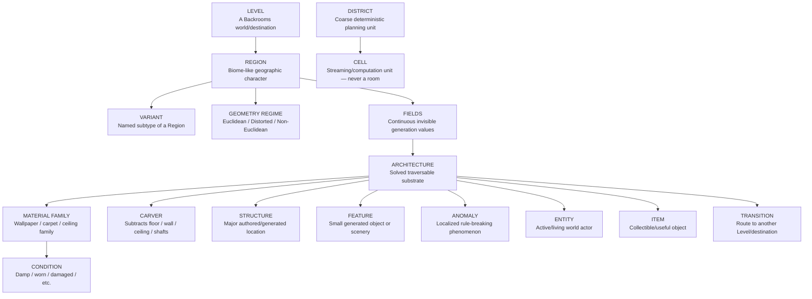

# Project Noclip World Bible

This is the canonical human-facing vocabulary and content catalog for Project Noclip.

GitHub code and accepted `STATUS.md` remain authoritative for exact runtime behaviour. This file answers a different question: **what kinds of things exist in the game, what are they called, and what state are they in?**

## Maintenance contract

When a change adds, removes, renames, reclassifies, or materially changes any **Level, Region, Variant, Geometry Regime, Field, Material Family, Condition, Feature, Structure, Carver, Anomaly, Entity, Item, Transition, District, Cell, or legacy worldgen category**, update this file in the same accepted pull request.

Rules:

- Never present planned content as implemented.
- Keep empty categories visible as `None implemented` so absence is obvious.
- Keep legacy implementation vocabulary documented until the migration that removes it is accepted.
- If code and this catalog disagree, resolve the mismatch before claiming the catalog is current.
- Material catalog changes should be mirrored to the mapped Project Noclip Notion page during the normal material Notion sync.
- A `Cell` is a technical streaming/computation unit, **not a room**.
- Generation 3 target architecture is tracked by GitHub Issue #31. This file records the vocabulary and catalog; Issue #31 records the migration work.

## Status vocabulary

| Status | Meaning |
|---|---|
| **Implemented** | Exists in the accepted playable/runtime build. |
| **Registered** | Exists in data/transition registries but is not a playable destination/content system yet. |
| **Legacy** | Exists in the current Gen-2 implementation but is intended to be replaced/reclassified by Gen 3. |
| **Planned** | Accepted direction, not implemented runtime behaviour yet. |
| **None implemented** | Category intentionally exists in the vocabulary but has no first-class implementation yet. |

---

# 1. Vocabulary chart



## Terms Sash can use with agents

| Term | Simple meaning | Minecraft-ish analogy | Current Project Noclip use |
|---|---|---|---|
| **Level** | A major Backrooms world/destination. | Dimension | Level 0 is playable; other destination IDs are registered exits only. |
| **Region** | A large coherent geographic/environmental area inside a Level. | Biome | Gen-3 preferred design term. Current code uses legacy `ZoneId`s for the closest equivalent. |
| **Variant** | A named subtype of a Region. | Biome variant | Gen-3 design term. Current `SpatialProfile`s are the nearest legacy equivalent, not canonical Region Variants. |
| **Geometry Regime** | The spatial law active in an area. | Terrain/world law | Gen-3 planned: Euclidean, Distorted, Non-Euclidean. Current playable topology is Euclidean. |
| **Field** | Smooth invisible value sampled from coordinates/seed that influences generation. | Noise field | Gen-3 planned. Examples: openness, partition pressure, dampness, stability. |
| **Material Family** | Named visual construction family. | Wood/block family | Planned. Current runtime has unnamed material variant indices and zone tints. |
| **Condition** | State layered onto a material/object. | Block state | Partially present through light states, stability, floor-patch kinds and visual condition data; not yet one unified system. |
| **Feature** | Small generated object/scenery. | Tree, ore, plant | Current prop system is the closest implementation. Gen 3 should move ordinary props fully into a feature layer. |
| **Structure** | Major special location/discovery. | Village, temple, stronghold | Manila Room is the clearest current example. Rare structures stay explicitly generated in Gen 3. |
| **Carver** | Subtractive generator that removes ordinary architecture. | Cave carver | Planned. Current holes are explicit room/components rather than a first-class carver pass. |
| **Anomaly** | Local phenomenon that breaks expected world behaviour. | Rare world phenomenon | No first-class anomaly registry yet; `hallucinationAnchor` is an internal precursor. |
| **Entity** | Active/living actor in the world. | Mob | None implemented as a routine world population system in the current Level 0 scope. |
| **Item** | Collectible/useful world object. | Item | Implemented item registry. |
| **Transition** | A route/trigger toward another Level or destination. | Portal/exit | Implemented exit registry foundations; destinations are not necessarily playable. |
| **District** | Coarse deterministic planning grouping. | Chunk region | Current generator groups cells into deterministic 5×5 districts for zone selection. |
| **Cell** | Internal streaming/computation unit. | Chunk | Implemented. Never use `cell` as a synonym for room. |
| **Archetype** | Legacy Gen-2 room-shape category. | Template archetype | Implemented but should become descriptive/diagnostic rather than the primary Gen-3 generator command. |
| **Spatial Profile** | Legacy Gen-2 composition profile. | Terrain/template profile | Implemented; expected to be superseded by field-derived conditions/variants. |
| **Component** | Legacy explicit structural module. | Jigsaw piece | Implemented; ordinary Level 0 should stop relying on recognizable module selection as Gen 3 lands. |

---

# 2. Current world catalog

## Levels

### Playable

| Level | Status | Notes |
|---|---|---|
| **Level 0** | **Implemented** | Current browser-first vertical slice and only playable Level. |

### Registered transition destinations — not implemented as playable Levels

| Destination | Status | Current transition label | Enabled exit foundation |
|---|---|---|---|
| **Level 1** | **Registered** | Garage-like transition | Yes |
| **Level 2** | **Registered** | Manila departure | Yes |
| **Level 27** | **Registered** | Carpet breach | Yes |
| **Level 483** | **Registered** | Weak wall breach | Yes |
| **Level 13** | **Registered** | Greenhouse doors | Yes |
| **Level 14** | **Registered** | Emergency exit | Yes |
| **Level 0.22** | **Registered** | Second Attempt | No |
| **Level 0.23** | **Registered** | Next Project | No |
| **Level 0.99** | **Registered** | Deep-distance fracture | No |
| **Red Rooms** | **Registered** | Crimson contamination | No |
| **Void** | **Registered** | Unresolved floor failure | No |

A registered destination means the Level/destination ID exists in the exit registry. It does **not** mean the destination has a playable implementation.

## Regions

Generation 3 uses **Region** as the preferred human design term. The accepted runtime still uses `ZoneId`, so these are listed as legacy region-like implementations until a verified migration changes the code.

| Current ID | Human label | Status | Gen-3 interpretation |
|---|---|---|---|
| `baseline` | Baseline Lobby / ordinary Level 0 | **Legacy implemented** | Primary ordinary Region; should emerge from stable field conditions rather than a hard room template. |
| `arch` | Arch Rooms | **Legacy implemented** | Region/condition currently biased toward arch compositions. |
| `pillar` | Pillar Field | **Legacy implemented** | Region/condition currently biased toward pillar-heavy compositions. |
| `blackout` | Blackout Zone | **Legacy implemented** | Degraded/electrically unstable Region candidate. |
| `holes` | Hole Section | **Legacy implemented** | Candidate Region/condition where future carver pressure produces floor/void failures. |
| `exit-threshold` | Exit Threshold | **Legacy implemented** | Better treated as a transition structure/state than a normal Region in Gen 3. |
| `manila` | Manila Room compatibility profile | **Legacy compatibility only** | **Not a Region.** Ordinary generation does not emit a Manila zone; Manila is one rare special Structure inside baseline Level 0. |

## Variants

### Canonical Gen-3 Region Variants

**None implemented yet.** Future named Variants should be added here only when accepted into design/runtime.

### Legacy spatial profiles

| Spatial profile | Status | Notes |
|---|---|---|
| `standard` | **Legacy implemented** | Ordinary composition profile. |
| `sparse-vista` | **Legacy implemented** | Broad/sparse composition profile. |
| `thin-channel` | **Legacy implemented** | Compressed/channel-like composition profile. |
| `pillar-expanse` | **Legacy implemented** | Open pillar-heavy composition profile. |

These are not yet canonical Gen-3 Region Variants; they are current Gen-2 composition metadata.

## Geometry Regimes

| Geometry regime | Status | Meaning |
|---|---|---|
| **Euclidean** | **Implemented baseline law** | Normal reversible spatial relationships and grid-connected world topology. |
| **Distorted** | **Planned Gen 3** | Space remains mostly navigable/continuous but dimensions, scale, angles, corridor length or architectural reconciliation become implausible. |
| **Non-Euclidean** | **Planned Gen 3** | Topology itself can violate normal expectations: impossible adjacency, loops, asymmetric routes, or other deterministic spatial-law breaks. |

Geometry Regime must remain distinct from visual weirdness. A strange-looking Euclidean room is still Euclidean. A non-Euclidean Region changes spatial/topological laws and therefore requires deterministic topology, save, navigation and streaming rules.

## Fields

### Canonical continuous Gen-3 fields

**None implemented as the Gen-3 field framework yet.** Issue #31 proposes the initial vocabulary:

- `openness`
- `partitionPressure`
- `axisFlow` / directional bias
- `roomScale`
- `columnPressure`
- `ceilingVariation`
- `regularity`
- `connectivityPressure`
- `dampness`
- `decay`
- `stability`
- `abnormality`
- `voidPressure`
- `clutterPressure`
- `electricalReliability`

Existing deterministic hash rolls, district weighting and stability systems are implementation precursors, not the accepted Gen-3 continuous field framework.

## Material Families

**None canonically named yet.**

Current runtime has:

- unnamed wall `materialVariant` indices;
- zone-specific wall/floor/ceiling/trim tints;
- generated ceiling pattern indices;
- floor patch kinds.

Gen 3 should introduce named Material Families only when visual/semantic families are actually defined, for example wallpaper, carpet and ceiling families. Do not invent names in this catalog before that work is accepted.

## Conditions

Current implemented condition-like values include:

| Condition system | Values / state |
|---|---|
| **Stability class** | `disorienting`, `semi-stable`, `stable`, `rendezvous`, `terminal` |
| **Light state** | `on`, `flicker`, `off` |
| **Floor patch kind vocabulary** | `damp`, `worn`, `dark`, `dry`, `hole` |
| **World shift** | deterministic `shiftEpoch` participates in some generated state |

A unified semantic Condition layer is **planned**, not implemented yet.

## Features

The current prop system is the legacy implementation closest to Gen-3 Features.

| Current prop/feature kind | Status |
|---|---|
| table | **Implemented** |
| chair | **Implemented** |
| cabinet | **Implemented** |
| box | **Implemented** |
| divider | **Legacy implemented** — ordinary divider grammar is targeted for retirement from primary Level-0 structure generation |
| pipe | **Implemented** |
| column | **Implemented** |
| bench | **Implemented** |
| book | **Implemented** |
| wall-panel | **Implemented** |
| ceiling-gap | **Implemented** |
| stain | **Implemented vocabulary** |
| carpet-patch | **Implemented vocabulary** |
| sign | **Legacy implemented vocabulary** — generated green baseline/threshold sign path was removed in dev.7 |

Gen 3 should distinguish **structural construction elements** from **Features** so columns/wall panels needed for architecture are not treated like decorative chairs/desks.

## Structures

| Structure | Status | Notes |
|---|---|---|
| **Manila Room** | **Implemented** | One delayed seed-derived far special room embedded in baseline Level 0; rendezvous direction. It is not a Region. |
| **Exit Threshold** | **Implemented legacy transition structure/state** | Current generator switches exit-bearing cells to `exit-threshold`; Gen 3 should model threshold architecture as a special transition/structure layer rather than ordinary geography. |
| **Maintenance/service complexes** | **Planned** | Candidate rare structures from Issue #31, not currently canonical content. |
| **Special stairwells/elevators** | **Planned** | Candidate rare structures from Issue #31, not currently canonical content. |
| **Anomalous office/settlement complexes** | **Planned** | Candidate future rare structures, not currently canonical content. |

## Carvers

**None implemented as a first-class carver pass.**

Current hole content is generated through explicit hole-related archetypes/components. Gen-3 planned carvers include:

- floor / void carver;
- wall-opening carver;
- shaft carver;
- ceiling / service-cavity carver;
- localized degradation/damage carver.

When carvers land, move each from Planned to Implemented and record which Regions/fields control them.

## Anomalies

**None implemented as a first-class anomaly registry.**

Current precursor:

- deterministic `hallucinationAnchor` boolean on eligible generated cells.

Future anomalies should be catalogued individually when they become real player-facing phenomena. Do not classify ordinary low stability, darkness or visual damage as an Anomaly unless it actually violates expected world behaviour.

## Entities

**None implemented as a routine generated world population system.**

The current phase explicitly avoids routine monsters/combat loops. Add each future Entity family here when accepted.

## Items

| Item | ID | Status |
|---|---|---|
| Flashlight | `flashlight` | **Implemented** |
| Battery | `battery` | **Implemented** |
| Almond Water | `almond-water` | **Implemented** |
| Permanent Marker | `marker` | **Implemented** |
| Paper Note | `paper-note` | **Implemented** |
| Glow Stick | `glow-stick` | **Implemented** |
| String Spool | `string-spool` | **Implemented** |
| Empty Can | `empty-can` | **Implemented** |
| Pry Tool | `pry-tool` | **Implemented** |

## Transitions

Current exit registry foundations:

| Destination | Trigger | Gate status |
|---|---|---|
| Level 1 | `gradual` | Registered + enabled when timeline/exposure gate is met |
| Level 2 | `manila-wait` | Registered + enabled when gate is met |
| Level 27 | `floor-breach` | Registered + enabled when gate is met |
| Level 483 | `wall-breach` | Registered + enabled when gate is met |
| Level 13 | `greenhouse-door` | Registered + enabled when gate is met |
| Level 14 | `emergency-door` | Registered + enabled when gate is met |
| Void | `floor-breach` | Registered, disabled |
| Level 0.22 | `emergency-door` | Registered, disabled |
| Level 0.23 | `emergency-door` | Registered, disabled |
| Level 0.99 | `anomalous-wall` | Registered, disabled |
| Red Rooms | `gradual` | Registered, disabled |

These are transition foundations inside Level 0, not proof that destination Levels are playable.

---

# 3. Legacy Gen-2 generation inventory

Keep this section until Generation 3 has actually replaced these concepts. It lets Sash and agents translate old code/issues into the new vocabulary without guessing.

## Current Room Archetypes

- `open-office`
- `split-suite`
- `narrow-hall`
- `alcove-ring`
- `service-corner`
- `wide-lobby`
- `arch-gallery`
- `arch-crossing`
- `pillar-grid`
- `pillar-aisle`
- `maintenance-bay`
- `flooded-corridor`
- `hole-gallery`
- `broken-floor`
- `manila-room`
- `transition-foyer`

**Gen-3 direction:** ordinary archetypes should increasingly become descriptive classification/diagnostics derived from fields and solved architecture. Special archetypes such as Manila/transition structures may remain explicit where appropriate.

## Current structural Component IDs

- `open-void`
- `offset-partition`
- `cross-partition`
- `thin-corridor`
- `alcove-pair`
- `pillar-scatter`
- `pillar-lattice`
- `arch-run`
- `service-bank`
- `divider-run`
- `bench-island`
- `storage-corner`
- `hole-field`
- `hole-rail`

**Gen-3 direction:** explicit ordinary `alcove-pair` and `divider-run` style selection should be retired from the primary base-world vocabulary as field-driven architecture replaces it. Similar shapes may emerge naturally from solved architecture.

---

# 4. Generation 3 target hierarchy

```text
Level
  -> Region
      -> Variant
      -> Geometry Regime
      -> multi-scale Fields
          -> architectural constraint solver
              -> continuous substrate
                  -> Material Families + Conditions
                  -> Carvers
                  -> Structures
                  -> Features
                  -> Anomalies
                  -> Entities
                  -> Items
                  -> Transitions

Technical support:
Seed -> District / coordinates -> Cells for streaming/computation -> stable IDs -> runtime mutations + save deltas
```

The hierarchy is conceptual, not a demand that every system be parented exactly this way in code. The hard design rule is: **world geography and spatial laws are generated before ordinary decoration/content is layered into them.**
